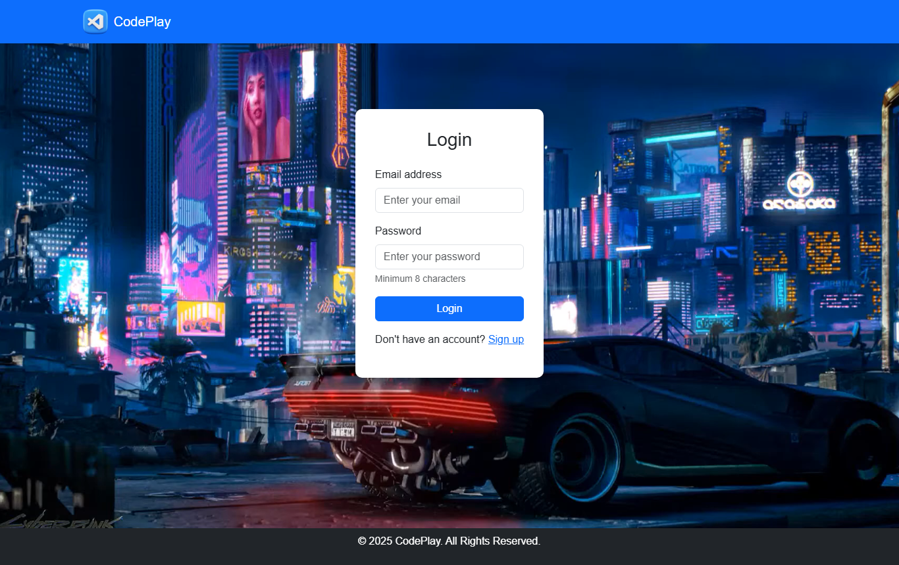
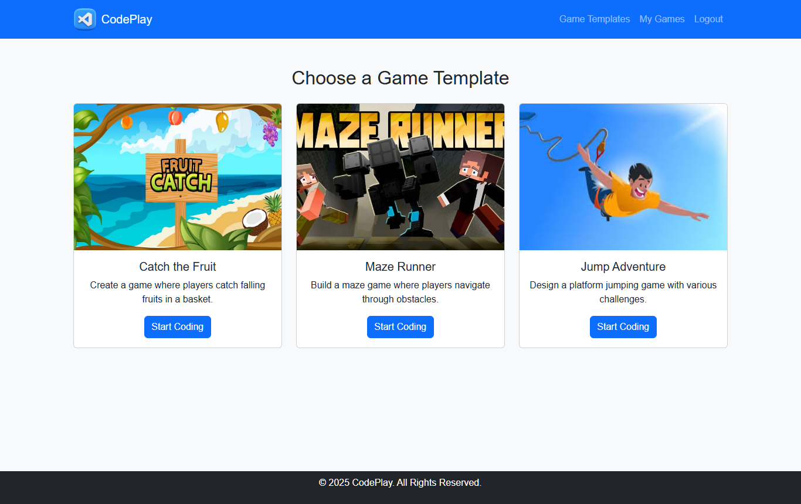
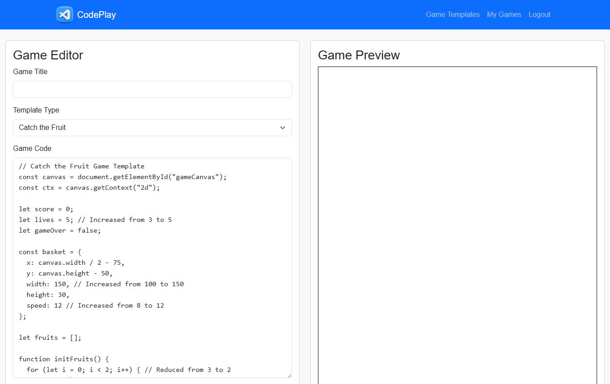
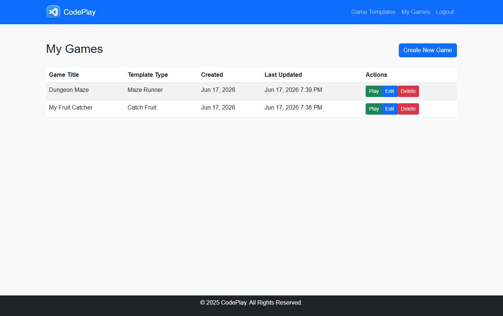

# CodePlay — Browser-Based Game Development Platform

[**▶ Live Demo — play & edit the game templates in your browser**](https://harshith0308.github.io/codeplay/demo/)


CodePlay is a full-stack web application that lets users sign up, choose from ready-made
game templates, edit the game code directly in the browser, and save and run their own
games. It was built as a Web Technology semester project.

The idea is to give beginners a friendly on-ramp into game programming: instead of starting
from a blank file, a user picks a working game template (Catch the Fruit, Maze Runner, or
Jump Adventure), tweaks the JavaScript in an in-browser editor, previews it live, and keeps
their creations under their own account.

<p align="center">
  
</p>


> **Try it live:** the [GitHub Pages demo](https://harshith0308.github.io/codeplay/demo/) hosts the three
> game templates with the same editable-code + live-preview workflow as the real editor.
> The full application (accounts, saving, MySQL persistence) is PHP-based — see
> [Getting Started](#getting-started) to run it locally.

## Features

- **User accounts** — sign up / log in / log out with securely hashed passwords (`password_hash`).
- **Game templates** — start from prebuilt templates (Catch the Fruit, Jump Adventure, Maze Runner).
- **In-browser code editor** — edit a game's JavaScript and preview it live next to the code.
- **My Games** — view, play, edit, and delete the games you've created.
- **Run games** — play saved games directly in the browser.
- Responsive UI built with Bootstrap 5, with cinematic full-screen video backgrounds.

## How It Works

**1. Sign up / log in.** Users create an account (passwords are hashed with PHP's
`password_hash`) and sign in. The auth pages feature a full-screen cyberpunk video background.

**2. Choose a game template.** After logging in, the dashboard presents the available
starter games, each with a thumbnail and description.

<p align="center">
  
</p>

**3. Code and preview.** Selecting a template opens the editor, which loads the template's
JavaScript on the left and a live game preview pane on the right. Users can rename the game,
edit the code, run it, and save it to their account.

<p align="center">
  
</p>

**4. Manage your games.** The "My Games" page lists every game the user has saved, with
quick actions to play, edit, or delete each one.

<p align="center">
  
</p>

## Tech Stack

| Layer    | Technology                     |
|----------|--------------------------------|
| Backend  | PHP (PDO)                      |
| Database | MySQL / MariaDB                |
| Frontend | HTML, CSS, JavaScript, Bootstrap 5 |
| Server   | Apache (XAMPP / WAMP)          |

## Project Structure

```
SEM 4 WEBTECH/
├── WT_Project/
│   ├── index.php              # Main single-file app (routing, views, auth)
│   ├── config.php             # Database connection (PDO)
│   ├── database_setup.sql     # Schema: users + games tables
│   ├── login.php / signup.php # Auth handlers
│   ├── logout.php
│   ├── editor.php             # Code editor view
│   ├── my_games.php           # User's saved games
│   ├── run_game.php           # Runs a saved game
│   ├── *.jpg / LOGO.png       # Template thumbnails & branding
│   └── *.html                 # Static auth pages
└── WEB TECHNOLOGY CODEPLAY REPORT.(docx|pdf)   # Project report
```

## Getting Started

### Prerequisites

- PHP 7.4+ (8.x recommended)
- MySQL / MariaDB
- A local server stack such as **XAMPP** or **WAMP**

### Setup

1. **Clone the repository** into your web server root (e.g. `htdocs` for XAMPP):

   ```bash
   git clone https://github.com/Harshith0308/codeplay.git
   ```

2. **Create the database.** Import the schema:

   ```bash
   mysql -u root -p < WT_Project/database_setup.sql
   ```

   This creates a `codeplay` database with `users` and `games` tables.

3. **Configure the database connection** in `WT_Project/config.php` if your MySQL
   credentials differ from the local defaults (host `localhost`, user `root`, empty password).

4. **Start Apache and MySQL** (via the XAMPP/WAMP control panel) and open:

   ```
   http://localhost/WT_Project/index.php
   ```

## Background Videos

The login/signup and editor pages use full-screen background videos. These large media
files are **not tracked in git** (see `.gitignore`) to keep the repository lightweight.

To enable the backgrounds locally, add the following files into the `WT_Project/` folder:

- `cyberpunk-2077-nighttime-metropolis.1920x1080.mp4` — login / signup / home background
- `nature.mp4` — editor / my games background

The app works fine without them; the pages simply fall back to a plain background.

## License

This project was created for academic coursework.
